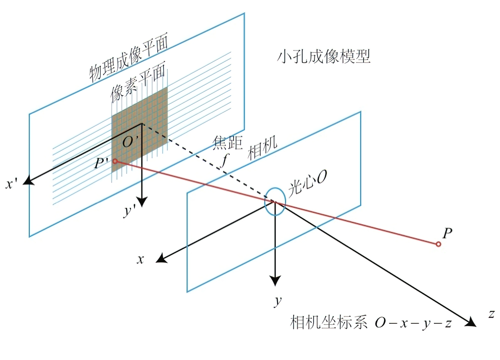

# “可见光近红外双通道火焰探测”纪要

> Jinhong Wu, March 31 2023

# 思路

> 源自王冲师兄。如何使用红外图像提高可见光图像识别效果。

1. **首先，完成相机内参（Intrinsics）“归一化”。**

* 应当明确，*归一化*并非是某种通用说法，只在本文中使用。
* 归一化的目的，是实现 [图像A，内参$\textbf{K}$] 至 [图像B，内参$\textbf{K}'$​]
  的转换。即，已知图像A的内参为$\textbf{K}$，给定内参$\textbf{K}'$，生成对应的图像B。
* 归一化的作用，是为了**假定**：可见光通道与近红外通道的图片分辨率一致。即它们矩阵的维度是一致的。
* 内参的作用，是为了**确定**：如何从以相机为原点的坐标系如何转换到像素坐标系？

2. **其次，完成相机外参（Extrinsics）标定，计算出外参矩阵。**

* 相机的位姿由旋转矩阵$\textbf{R}$和平移向量$\textbf{t}$来表示。
* 外参矩阵的作用，是为了**确定**：如何从世界坐标系转换到以相机为原点的坐标系？

3. **再次，依据外参矩阵，求对极线（Epipolarline）。**

* 依据两相机间的对极约束，求得对极线。
* 在对极线上搜索我们需要的点，至此，便完成了由图像A的点$\textbf{P}$对应至图像B的点$\textbf{P}'$的过程。

4. **最后，编写规则，判定点**​$\textbf{P}'$​**是否确实满足火点的图像特征。**

# 过程

> *参考文献*
>
> 1. [一文带你搞懂相机内参外参(Intrinsics &amp; Extrinsics) - 知乎 (zhihu.com)](https://zhuanlan.zhihu.com/p/389653208)
> 2. [通过EXIF计算相机内参 - 知乎 (zhihu.com)](https://zhuanlan.zhihu.com/p/444302513)
> 3. [由相机的自身参数求解内参矩阵_相机内参矩阵计算_XDWX的博客-CSDN博客](https://blog.csdn.net/baidu_38172402/article/details/83714232)
> 4. [python opencv实现相机内参标定_python 内参标定_安布奇的博客-CSDN博客](https://blog.csdn.net/anbuqi/article/details/128414745)
> 5. [python利用opencv进行相机标定(完全版)_opencv标定程序_dgut_guangdian的博客-CSDN博客](https://blog.csdn.net/dgut_guangdian/article/details/107467070)
> 6. [【OpenCV】OpenCV-Python实现相机标定+利用棋盘格相对位姿估计_棋盘格 位姿估计_Quentin_HIT的博客-CSDN博客](https://blog.csdn.net/qq_29931565/article/details/119395353)
> 7. [相机标定之张正友标定法数学原理详解（含python源码） - 知乎 (zhihu.com)](https://zhuanlan.zhihu.com/p/94244568)

## 相机内外参



* 由**相机坐标系**（$O-x-y-z$）转换为**像素坐标系**​（$o-u-v$，但原点$o'$在图像的左上角）

    * 其中，设**相机坐标系**中：实物点$\mathbf{P}$的坐标为$[X,Y,Z]^T$，成像点$\textbf{P}'$的坐标为$[X',Y',Z']^T$，焦距为$f$。
    * 设**像素坐标系**中：像素坐标在$u$轴上缩放了$\alpha$倍，在$v$轴上缩放了$\beta$倍，原点平移了$[c_x,c_y]^T$。
    * 设：使用$f_x$，$f_y$替换$\alpha f$，$\beta f$，单位为像素。
    * 需要求取成像点$P'$在像素坐标系中的坐标。

  $$
  Z
  \left[\begin{matrix}
  u\\v\\1
  \end{matrix}\right]=
  \left[\begin{matrix}
  f_x & 0 & c_x \\ 0 & f_y & c_y \\ 0 & 0 & 1
  \end{matrix}\right]
  \left[\begin{matrix}
  X\\Y\\Z
  \end{matrix}\right]=
  \mathbf{KP}
  $$

    * $\mathbf{K}$为相机的内参矩阵（Intrinsics）。通常来说，相机的内参在出厂之后就是固定的了，可通过相机标定的方式人为计算出来。通常写成

      $$
      \mathbf{K}=
      \left[\begin{matrix}
      f_x & 0 & c_x \\
      0 & f_y & c_y \\
      0 & 0 & 1 \\
      \end{matrix}\right]=
      \left[\begin{matrix}
      \frac{f}{\mathrm{d}x} & 0 & c_x \\
      0 & \frac{f}{\mathrm{d}y} & c_y \\
      0 & 0 & 1 \\
      \end{matrix}\right]
      $$

      其中$f$表示焦距，单位mm，$1/\mathrm{d}x$和$1/\mathrm{d}y$分别表示图像$x$和$y$方向上每mm各占多少个像素。

      $c_x$，$c_y$表示图像坐标系中心的便宜距离，一般为图像长、宽的一半。
* 由**世界坐标系**中的$\mathbf{P}_w$变换到**相机坐标系**中的$\mathbf{P}$

    * 相机的位姿由旋转矩阵$\textbf{R}$和平移向量$\textbf{t}$来描述，有

      $$
      \mathbf{P}=\mathbf{RP}_w+\mathbf{t}
      $$
    * 带入内参等式，有

      $$
      Z\mathbf{P}_{uv}=
      \mathbf{K}(\mathbf{RP}_w+\mathbf{t})=
      \mathbf{KTP}_w
      $$
    * $Z$是物距，**外参矩阵**通常写成

      $$
      \mathbf{T}=
      \left[\begin{matrix}
      \mathbf{R} & \mathbf{t} \\ 0 & 1
      \end{matrix}\right]
      $$
    * 那么原式最后一个等号应当是蕴含了由非齐次坐标至齐次坐标的变换，有

      $$
      Z\mathbf{P}_{uv}=
      \mathbf{K}(\mathbf{RP}_w+\mathbf{t}) \Rightarrow
      \left[\begin{matrix}
      \mathbf{K} & 1
      \end{matrix}\right]
      \left[\begin{matrix}
      \mathbf{R} & \mathbf{t} \\ 0 & 1
      \end{matrix}\right]
      \left[\begin{matrix}
      \mathbf{P}_w \\ 1
      \end{matrix}\right]
      $$

## 内外参的计算

### 内参计算

1. 由相机自身参数求解

   以华顺利200万像素工业摄像机为例：已知摄像头的焦距为4mm，像片的尺寸大小为640×480，传感器尺寸为5856μm×3276μm。

   > $$
   > \mathbf{K}=
   > \left[\begin{matrix}
   > f_x & 0 & c_x \\
   > 0 & f_y & c_y \\
   > 0 & 0 & 1 \\
   > \end{matrix}\right]=
   > \left[\begin{matrix}
   > \frac{f}{\mathrm{d}x} & 0 & c_x \\
   > 0 & \frac{f}{\mathrm{d}y} & c_y \\
   > 0 & 0 & 1 \\
   > \end{matrix}\right]
   > $$
   >

   $$
   \begin{align*}
   c_x &= \frac{640}{2}=320\\
   c_y &= \frac{480}{2}=240\\
   \mathrm{d}x &= \frac{5.856}{640}=0.00915\\
   \mathrm{d}y &= \frac{3.276}{480}=0.006825\\
   \text{若焦距为4mm}\\
   f_x &= \frac{f}{\mathrm{d}x}=437.158470\\
   f_y &= \frac{f}{\mathrm{d}y}=586.080586
   \end{align*}
   $$
2. 由EXIF求解

   通过Python库exifread进行操作，可以直接读取焦距、长宽，得出$f$，$c_x$，$c_y$，难点在于如何求取$\mathrm{d}x$，$\mathrm{d}y$。

* 方法一：读取相机型号，网上搜索其传感器尺寸，通过由相机自身参数求解[^1]方法求解。
* 方法二：读取等效35mm胶片焦距信息，据此换算实际CCD尺寸，然后求解。

3. 人为通过“棋盘格”相机标定求解

### 内参归一化

#### 数学推导

* 对于世界坐标系中的一点$\mathbf{P}(x,y,z)$，在图像A中一定有等式

  $$
  Z_1
  \left[\begin{matrix}
  u_1 \\ v_1 \\ 1
  \end{matrix}\right]=
  \mathbf{K}_1 \mathbf{P}\\
  \Downarrow\\
  \mathbf{K}_1^{-1}
  Z_1
  \left[\begin{matrix}
  u_1 \\ v_1 \\ 1
  \end{matrix}\right]=
  \mathbf{P}
  $$
* 在图像B中一定有等式

  $$
  Z_2
  \left[\begin{matrix}
  u_2 \\ v_2 \\ 1
  \end{matrix}\right]=
  \mathbf{K}_2 \mathbf{P}\\
  \Downarrow\\
  \mathbf{K}_2^{-1}
  Z_2
  \left[\begin{matrix}
  u_2 \\ v_2 \\ 1
  \end{matrix}\right]=
  \mathbf{P}
  $$
* 则有

  $$
  \mathbf{K}_1^{-1}
  Z_1
  \left[\begin{matrix}
  u_1 \\ v_1 \\ 1
  \end{matrix}\right]=
  \mathbf{K}_2^{-1}
  Z_2
  \left[\begin{matrix}
  u_2 \\ v_2 \\ 1
  \end{matrix}\right]
  $$
* 假设图像A，图像B拍摄时的物距一致，也就是$Z_1=Z_2$，则有

  $$
  \mathbf{K}_1^{-1}
  \left[\begin{matrix}
  u_1 \\ v_1 \\ 1
  \end{matrix}\right]=
  \mathbf{K}_2^{-1}
  \left[\begin{matrix}
  u_2 \\ v_2 \\ 1
  \end{matrix}\right]
  $$
* 变换得到

  $$
  \mathbf{K}_2\mathbf{K}_1^{-1}
  \left[\begin{matrix}
  u_1 \\ v_1 \\ 1
  \end{matrix}\right]=
  \left[\begin{matrix}
  u_2 \\ v_2 \\ 1
  \end{matrix}\right]
  $$
* 即，像素坐标系中从图像A转换到图像B的表达式。
* 但是$u_2$, $v_2$并非刚好就是图片中对应的像素位置（并非就是整数），例如计算出来的点落在$(5.6, 4.4)
  $的位置，那么就需要通过插值来计算出$(5, 4)$对应的像素点的像素值。

#### 向量化的Python实现

* 首先生成一个索引行向量纵向堆叠的矩阵

  ```python
  import numpy as np

  ...
  width, height = img_array.shape[::-1]
  idx = np.ones((height * width, 3), np.float32)
  idx[:2, :] = np.mgrid[:width, :height].T.reshape(-1, 2).T
  ```

  得到

  $$
  \mathrm{idx}=
  \begin{bmatrix}
    0. & 1. & 2. & \dots & \mathrm{height} & 0. & 1. & 2. & \dots & \mathrm{height} & \dots & \mathrm{height} \\
    0. & 0. & 0. & \dots & 0. & 1. & 1. & 1. & \dots & 1. & \dots & \mathrm{width} \\
    1. & 1. & 1. & \dots & 1. & 1. & 1. & 1. & \dots & 1. & \dots & 1.
       \end{bmatrix}\\
       \mathrm{shape}=(\mathrm{3, height}\times \mathrm{width})
       $$

  因此

  $$
  \mathrm{idx\_new} =
  \textbf{K}_2\textbf{K}_1^{-1}\cdot \mathrm{idx}\\
  \Downarrow\\
  \mathrm{idx\_new}=
  \begin{bmatrix}
  u. & u. & u. & \dots & \mathrm{height} & 0. & 1. & 2. & \dots & \mathrm{height} & \dots & \mathrm{height} \\
  v. & v. & v. & \dots & 0. & 1. & 1. & 1. & \dots & 1. & \dots & \mathrm{width} \\
    1. & 1. & 1. & \dots & 1. & 1. & 1. & 1. & \dots & 1. & \dots & 1.
       \end{bmatrix}\\
       \mathrm{shape}=(\mathrm{3, height}\times \mathrm{width})
       $$
* 所以`idx_new[:, 0]`​就是`idx[:, 0]`​对应的转换坐标，得到的新坐标是浮点型，并非直接对应像素位置，需要做一定的插值计算，细节这里不表。最终得到我们像素对的映射关系。
* 然后利用这个像素对的映射关系赋值，由于计算得到的$u$，$v$会存在负数，需要先排除掉，然后直接赋值。

  ```python
  def vectorized_assignment(_array_a: np.ndarray, _array_b: np.ndarray,
                            _idx_a: np.ndarray, _idx_b: np.ndarray) -> np.ndarray:
      """
      Assigns the values to _array_b according to idx_b and corresponding values of 
  _array_a.
      """
      _idx_b_copy = _idx_b.copy()
      _idx_b_copy[_idx_b > 0] = 0
      _idx_b_zero_sum = np.sum(_idx_b_copy, axis=0)
      _idx_b = _idx_b[:, _idx_b_zero_sum == 0]
      _idx_a = _idx_a[:, _idx_b_zero_sum == 0]
      _array_b[_idx_b[1, :], _idx_b[0, :]] = _array_a[_idx_a[1, :], _idx_a[0, :]]
      return _array_b
  ```

### 外参计算

* 通过外参标定进行计算——张正友标定法。
* 具体过程省略，参考前述资料。

### 外参归一化

#### 数学推导

* 基于等式

  $$
  Z\mathbf{P}_{uv}=\mathbf{KTP}_w\\
  \Downarrow\\
  Z_1 \mathbf{P}_{uv1}=\mathbf{K}_1\mathbf{T}_1\mathbf{P}_w\\
  Z_2 \mathbf{P}_{uv2}=\mathbf{K}_2\mathbf{T}_2\mathbf{P}_w\\
  \Downarrow\\
  \mathbf{T}_1^{-1}\mathbf{K}_1^{-1}Z_1 \mathbf{P}_{uv1}=\mathbf{P}_w
  $$
* 整理得到

  $$
  \mathbf{P}_{uv2}=
  \frac{Z_1}{Z_2}\mathbf{K}_{2}\mathbf{T}_2\mathbf{T}_1^{-1}\mathbf{K}_1^{-1}\mathbf{P}_{uv1}
  $$

  $\textbf{P}_{uv2}$是要求解的向量，对应于图片B的像素坐标。

  观察内参的计算式与上述有何不同

  $$
  \mathbf{P}_{uv2}=
  \mathbf{K}_2 \mathbf{K}_1^{-1} \mathbf{P}_{uv1}
  $$
* 但是发现$\mathbf{T}$是补齐之后的矩阵，维度为$(4, 4)$，因此无法正常进行点乘运算。因此考虑不进行齐次坐标转换的推理，结果如下

  $$
  \begin{aligned}
  \mathbf{R}_1^{-1}(\mathbf{K}_1^{-1} Z_1 \mathbf{P}_{uv1} - \mathbf{t}_1) &= \mathbf{R}_2^{-1}(\mathbf{K}_2^{-1} Z_2
  \mathbf{P}_{uv2} - \mathbf{t}_2) \\
  \Rightarrow \quad \mathbf{P}_{uv2} &= \frac{1}{Z_2} \mathbf{K}_2 \mathbf{R}_2 (\mathbf{R}_1^{-1}(\mathbf{K}_1^{-1} Z_1
  \mathbf{P}_{uv1} - \mathbf{t}_1)) + \frac{\mathbf{K}_2 \mathbf{t}_2}{Z_2}
  \end{aligned}
  $$
* 同样存在问题，因为$Z_1$，$Z_2$又无法消去，最终计算得到的$\mathbf{P}_{uv2}$很可能是错误的。
* 通过参考相机标定之张正友标定法数学原理详解（含python源码） - 知乎 (zhihu.com)[^2]，对$\mathbf{T}$进行修改

  $$
  \mathbf{T} =
  \left[
  \begin{matrix}
  \mathbf{R_1} & \mathbf{R_2} & \mathbf{t}
  \end{matrix}
  \right]
  $$

  其中，$\mathbf{R_1}$，$\mathbf{R_2}$为旋转矩阵的前两列，$\mathbf{t}$为平移向量（矩阵），有

  ```python
  rotation_matrix = cv2.Rodrigues(rvecs)
  # rotation_matrix = \mathbf{R}
  ```

  $$
  \mathbf{R} =
  \left[
  \begin{matrix}
  \mathbf{R_1} & \mathbf{R_2} & \mathbf{R_3}
  \end{matrix}
  \right]
  $$
* 因此将该$\mathbf{T}$代回求解$\textbf{P}_{uv2}$的式子，即可完成重映射。
* 至此，内外参归一化均已完成。

‍

[^1]:
$$

    \mathbf{K}=
    \left[\begin{matrix}
    f_x & 0 & c_x \\
    0 & f_y & c_y \\
    0 & 0 & 1 \\
    \end{matrix}\right]=
    \left[\begin{matrix}
    \frac{f}{\mathrm{d}x} & 0 & c_x \\
    0 & \frac{f}{\mathrm{d}y} & c_y \\
    0 & 0 & 1 \\
    \end{matrix}\right]
    $$

    1. 由相机自身参数求解

        以华顺利200万像素工业摄像机为例：已知摄像头的焦距为4mm，像片的尺寸大小为640×480，传感器尺寸为5856μm×3276μm。

        $$
        \begin{align*}
        c_x &= \frac{640}{2}=320\\
        c_y &= \frac{480}{2}=240\\
        \mathrm{d}x &= \frac{5.856}{640}=0.00915\\
        \mathrm{d}y &= \frac{3.276}{480}=0.006825\\
        \text{若焦距为4mm}\\
        f_x &= \frac{f}{\mathrm{d}x}=437.158470\\
        f_y &= \frac{f}{\mathrm{d}y}=586.080586
        \end{align*}
        $$

[^2]: 7. [相机标定之张正友标定法数学原理详解（含python源码） - 知乎 (zhihu.com)](https://zhuanlan.zhihu.com/p/94244568)
